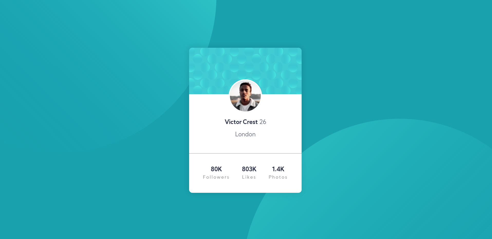
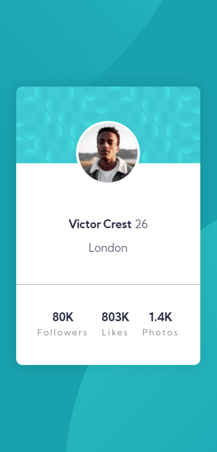

# Frontend Mentor - Profile card component

## Table of contents

- [Overview](#overview)
  - [The challenge](#the-challenge)
  - [Screenshot](#screenshot)
  - [Links](#links)
- [My process](#my-process)
  - [Built with](#built-with)
  - [What I learned](#what-i-learned)
  - [Continued development](#continued-development)
  - [Useful resources](#useful-resources)
- [Author](#author)
- [Acknowledgments](#acknowledgments)

## Overview

### The challenge

- Build out the project to the designs provided

### Screenshot

### Desktop View

### Mobile View

### Links

- Solution URL: [Github Link](https://github.com/SaiPradeepti/Frontendmentor-Challenges/tree/main/01-profile-card-component-main)
- Live Site URL: [live site](https://profile-card-component-01.netlify.app/)

## My process

### Built with

- Semantic HTML5 markup
- CSS custom properties
- Flexbox
- CSS Grid

### Useful resources

- [Flexbox Article](https://css-tricks.com/snippets/css/a-guide-to-flexbox/)
