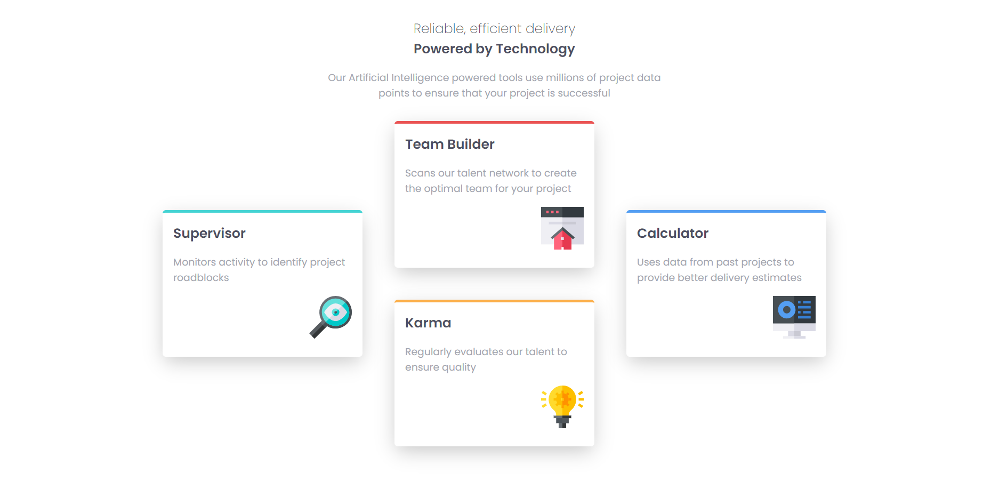
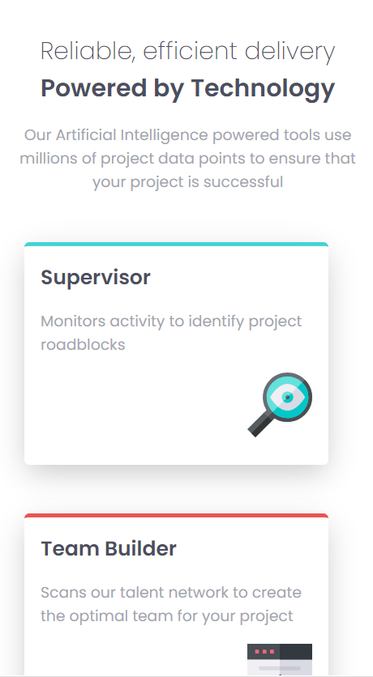
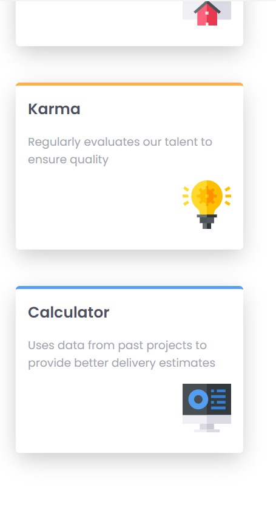

# Frontend Mentor - Four card feature section solution

This is a solution to the [Four card feature section challenge on Frontend Mentor](https://www.frontendmentor.io/challenges/four-card-feature-section-weK1eFYK).

## Table of contents

- [Overview](#overview)
  - [Screenshot](#screenshot)
  - [Links](#links)
  - [Built with](#built-with)
  - [Useful resources](#useful-resources)
  - [Author](#author)

## Overview

### Screenshot

- Desktop View

- Mobile View

### Links

- Solution URL: [Solution](https://github.com/SaiPradeepti/Frontendmentor-Challenges/tree/main/02-four-card-feature-section-master)
- Live Site URL: [Live site](https://four-card-feature-section-master-02.netlify.app/)

### Built with

- Semantic HTML5 markup
- SCSS
- Flexbox
- Mobile-first workflow

## Useful resources

- [SCSS](https://scss-code-snippets.netlify.app/)

## Author

- Frontend Mentor - [@SaiPradeepti](https://www.frontendmentor.io/profile/SaiPradeepti)
