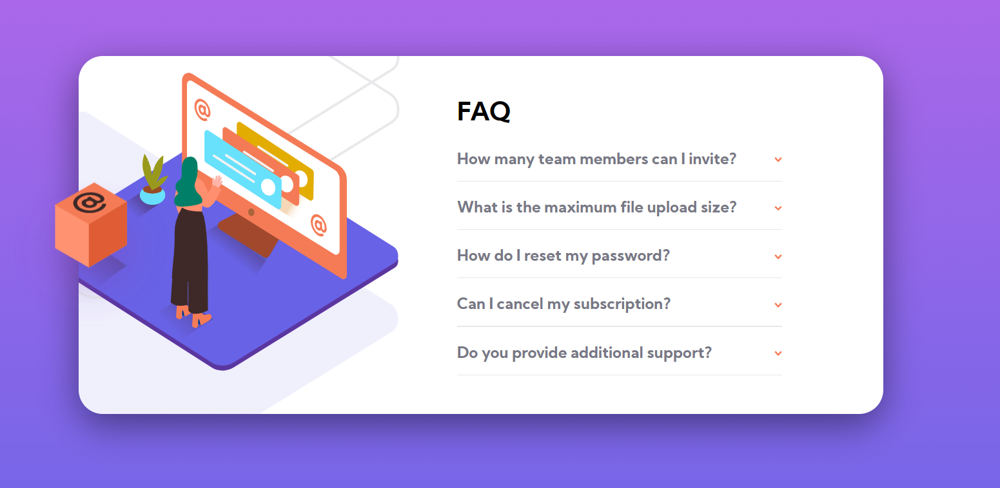

# Frontend Mentor - FAQ accordion card solution

## Table of contents

- [Overview](#overview)
- [The challenge](#the-challenge)
- [Screenshot](#screenshot)
- [Links](#links)
- [Built with](#built-with)

## Overview

### The challenge

Users should be able to:

- View the optimal layout for the component depending on their device's screen size
- See hover states for all interactive elements on the page
- Hide/Show the answer to a question when the question is clicked

### Screenshot

- Desktop View

- Mobile View

### Links

- [Solution URL](https://github.com/SaiPradeepti/Frontendmentor-Challenges/tree/main/03faq-accordion-card-main)
- [Live Site URL](https://faq-accordion-card-main-03.netlify.app/)

### Built with

- HTML5 markup
- SCSS
- Flexbox
- [React](https://reactjs.org/) - JS library

## Author

- Frontend Mentor - [@SaiPradeepti](https://www.frontendmentor.io/profile/SaiPradeepti)
