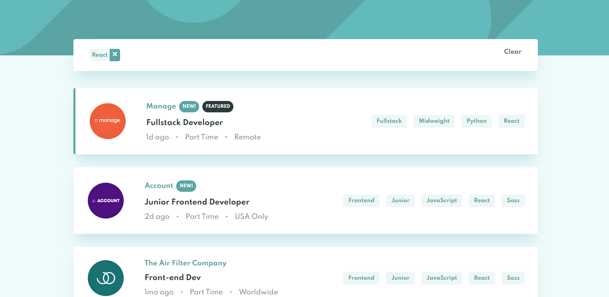
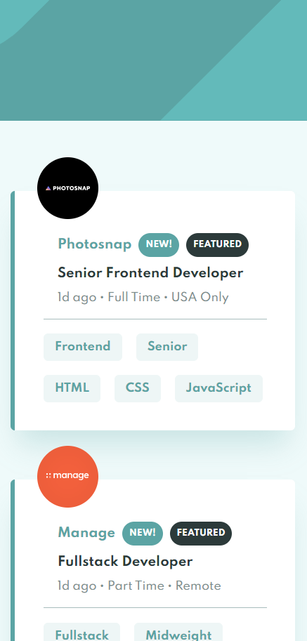
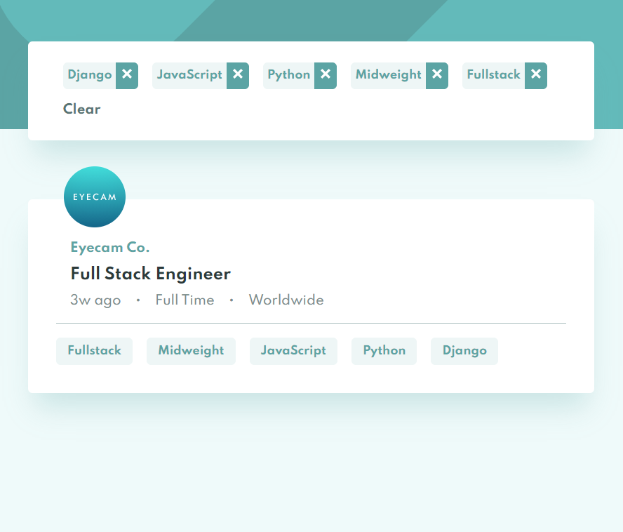
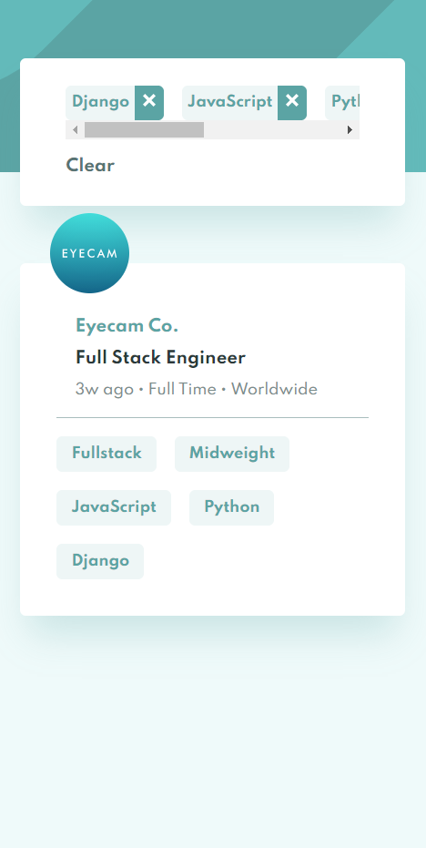

# Frontend Mentor - Job listings with filtering solution

This is a solution to the [Job listings with filtering challenge on Frontend Mentor](https://www.frontendmentor.io/challenges/job-listings-with-filtering-ivstIPCt). Frontend Mentor challenges help you improve your coding skills by building realistic projects.

## Table of contents

- [Overview](#overview)
  - [The challenge](#the-challenge)
  - [Screenshot](#screenshot)
  - [Links](#links)
- [My process](#my-process)
  - [Built with](#built-with)
- [Author](#author)

## Overview

### The challenge

Users should be able to:

- View the optimal layout for the site depending on their device's screen size
- See hover states for all interactive elements on the page
- Filter job listings based on the categories

### Screenshot

#### Desktop View

#### Mobile View

### Links

- Solution URL: [https://github.com/SaiPradeepti/Frontendmentor-Challenges/tree/main/04job-listings-with-filtering](https://github.com/SaiPradeepti/Frontendmentor-Challenges/tree/main/04job-listings-with-filtering)
- Live Site URL: [https://job-listings-with-filtering-04.netlify.app/](https://job-listings-with-filtering-04.netlify.app/)

## My process

### Built with

- Semantic HTML5 markup
- SCSS
- Flexbox
- CSS Grid
- [React](https://reactjs.org/) - JS library
- [React-Icons](https://react-icons.github.io/react-icons/)
- [React Reveal](https://www.react-reveal.com/) - Animation Framework for React

## Author

- Frontend Mentor - [@SaiPradeepti](https://www.frontendmentor.io/profile/SaiPradeepti)
