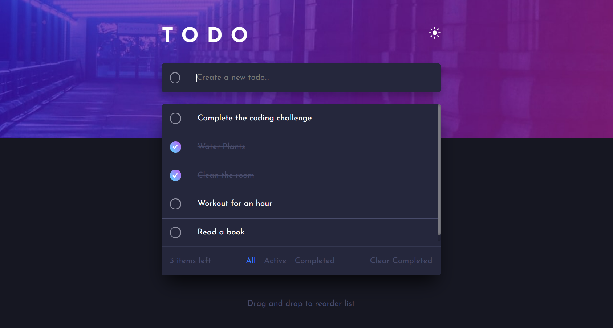
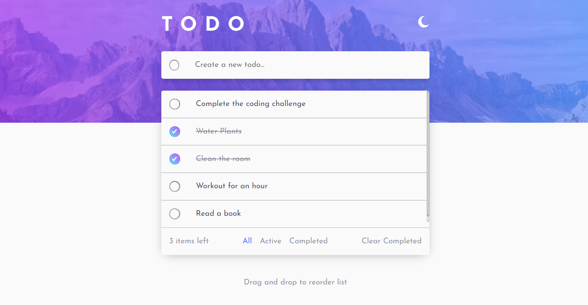
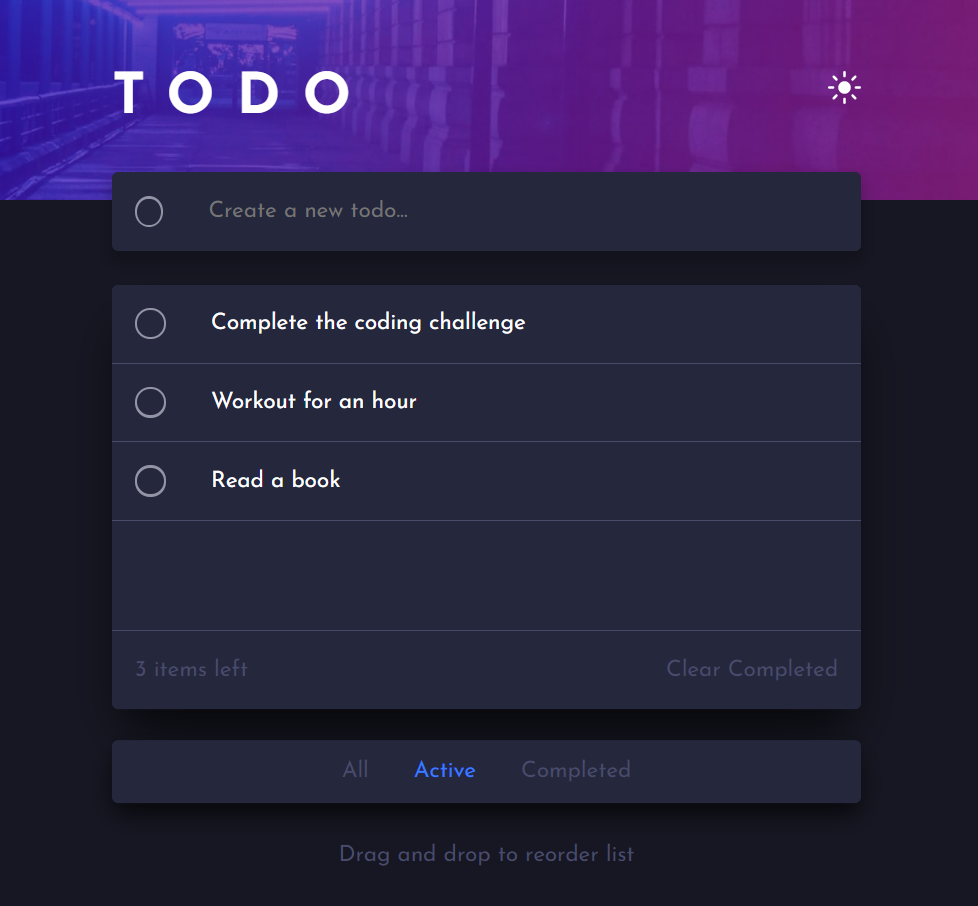
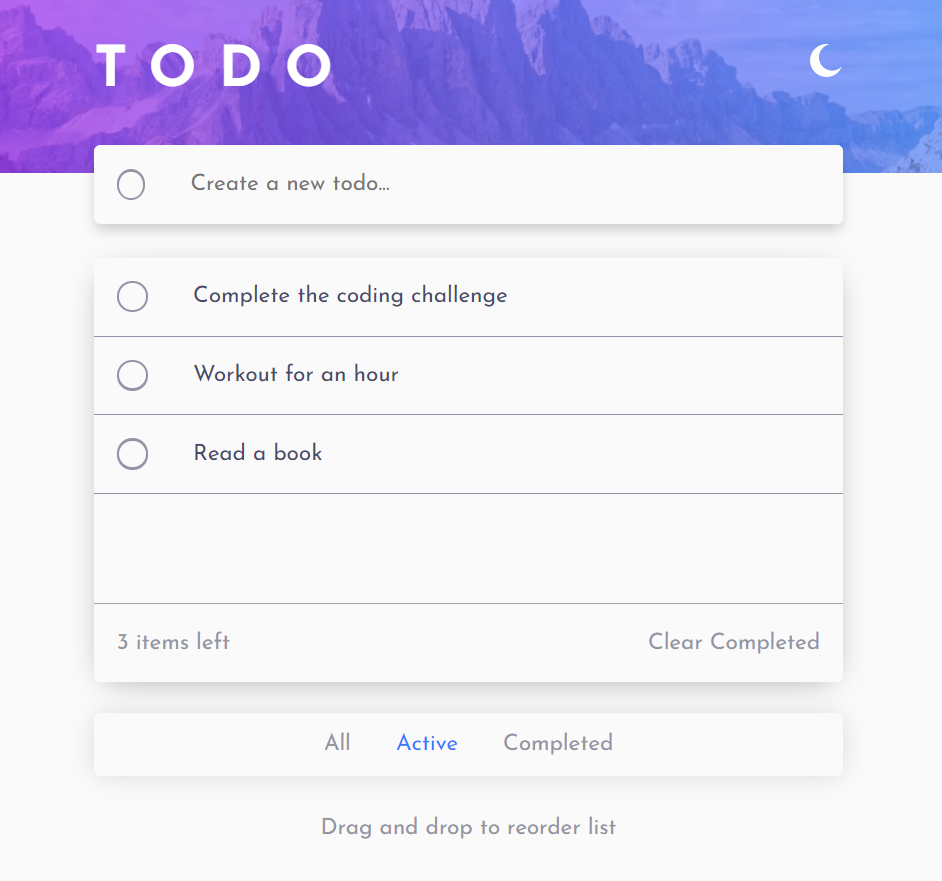
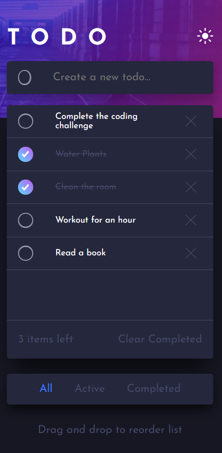
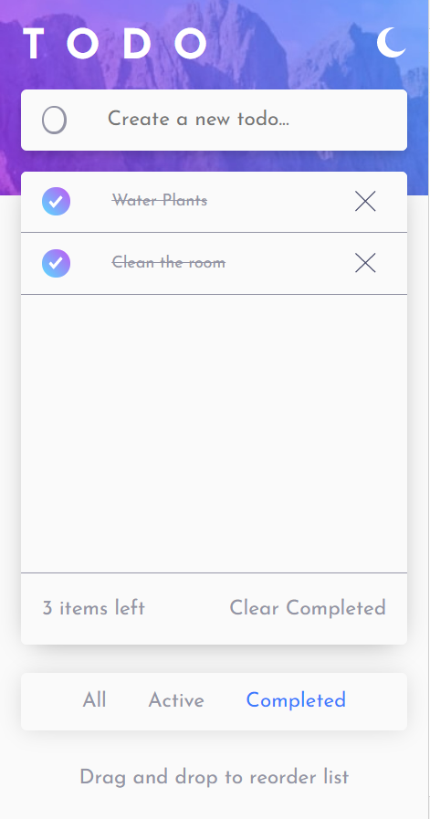

# Frontend Mentor - Todo app solution

This is a solution to the [Todo app challenge on Frontend Mentor](https://www.frontendmentor.io/challenges/todo-app-Su1_KokOW).

## Table of contents

- [Overview](#overview)
  - [The challenge](#the-challenge)
  - [Screenshot](#screenshot)
  - [Links](#links)
- [My process](#my-process)
  - [Built with](#built-with)
  - [Useful resources](#useful-resources)
- [Author](#author)

## Overview

### The challenge

Users should be able to:

- View the optimal layout for the app depending on their device's screen size
- See hover states for all interactive elements on the page
- Add new todos to the list
- Mark todos as complete
- Delete todos from the list
- Filter by all/active/complete todos
- Clear all completed todos
- Toggle light and dark mode
- Drag and drop to reorder items on the list

### Screenshots

| DarkTheme                      |           LightTheme           |
| :----------------------------- | :----------------------------: |
|  |  |
|  |  |
|  |  |

### Links

- Solution URL: [Solution](https://github.com/SaiPradeepti/Frontendmentor-Challenges/tree/main/06todo-app-main)
- Live Site URL: [Live Site](https://todo-app-main-saipradeepti.netlify.app/)

## My process

### Built with

- Semantic HTML5 markup
- CSS custom properties
- Flexbox
- SASS
- React
- LocalStorage - For retaining Todo List
- [react-beautiful-dnd](https://github.com/atlassian/react-beautiful-dnd) - Drag and Drop for React

### Useful resources

- [React Beautiful dnd](https://github.com/atlassian/react-beautiful-dnd)
- [DragDropContext](https://github.com/atlassian/react-beautiful-dnd/blob/master/docs/api/drag-drop-context.md)
- [Droppable](https://github.com/atlassian/react-beautiful-dnd/blob/master/docs/api/droppable.md)
- [Draggable](https://github.com/atlassian/react-beautiful-dnd/blob/master/docs/api/draggable.md)

## Author

- Frontend Mentor - [@SaiPradeepti](https://www.frontendmentor.io/profile/SaiPradeepti)
